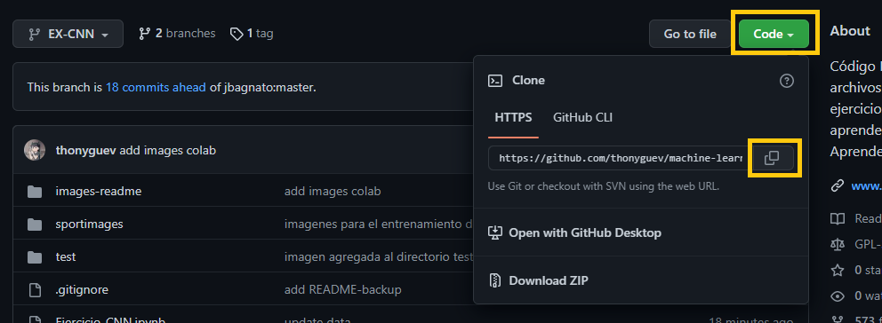
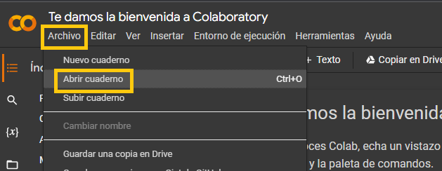
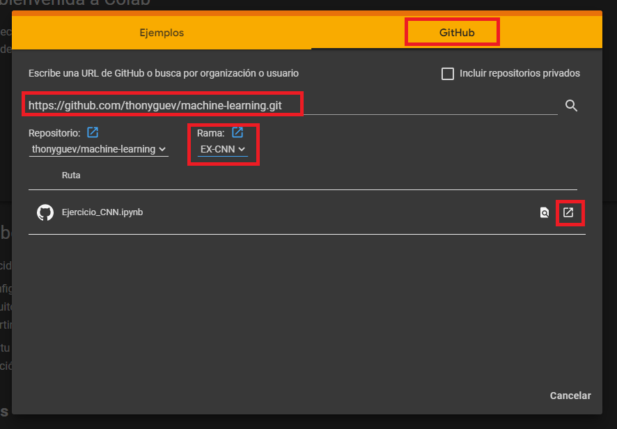
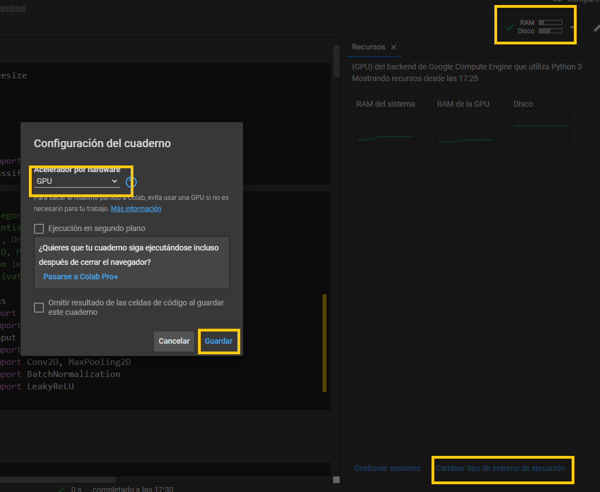

# Ejercicio CNN Convolutional Neural Networks y Set de imagenes MNIST de deportes
# Google Colab


<br/>

<br/>

<br/>

<br/>

# Entorno local
## Configuracion del entorno de Python
* Verificar si la version de python instalada es 3.7.13

    *   ```PowerShell
        python --version
        ```
* Crea un entorno virtual de python
    *   ```PowerShell
        python -m venv venv
        ```
* Activa el entorno virtual de python
    *   ```PowerShell
        .\venv\Scripts\Activate.ps1
        ```
* Actualiza el manejador de paquetes de python - pip
    *   ```PowerShell
        python -m pip install --upgrade pip
        ```
* Instala los paquetes necesarios para el notebook de jupyter
    *   ```PowerShell
        pip install -r requirements.txt
        ```